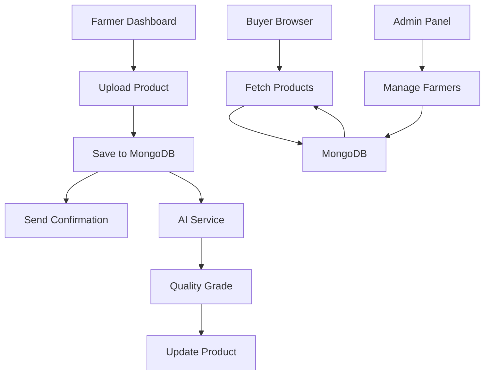

# FarmLink AI - System Architecture

## Overview

FarmLink AI is a hyperlocal supply chain platform that connects farmers directly with buyers using AI. The system consists of four main components:

1. **Farmer Interface**: Web-based dashboard for product listing
2. **AI Service**: Automatic quality grading
3. **Buyer Interface**: Real-time marketplace
4. **Admin Interface**: Farmer and product management

## Data Flow

## Component Details

### 1. Farmer Interface (Web Dashboard)
- Farmers upload products through web dashboard
- System processes product details and images
- Sends immediate confirmation within website
- Stores product in MongoDB with "pending" grade

### 2. AI Service (Python/Flask)
- Receives image URL via REST API
- Runs computer vision model on image
- Returns quality grade (A/B/C) and score (0-100)
- Updates product in MongoDB with grade

### 3. Buyer Interface (Web)
- Real-time marketplace showing all products
- Filters by quality grade
- "Order Now" button for each product
- Modal form for buyer details

### 4. Admin Interface (Web)
- Farmer management (approve/reject)
- Product monitoring
- Statistics dashboard
- Manual product creation

## Technology Stack Details

### Backend (Node.js)
- **express**: Web framework
- **mongoose**: MongoDB ODM
- **axios**: HTTP client for AI service
- **dotenv**: Environment configuration
- **cors**: Cross-origin resource sharing
- **body-parser**: Request parsing

### Frontend (Vanilla JavaScript)
- **No frameworks**: Pure JS for simplicity
- **Modern CSS3**: Glass morphism, gradients, animations
- **Responsive design**: Mobile-first approach
- **Real-time updates**: Auto-refresh every 30 seconds

### AI Service (Python/Flask)
- **flask**: Lightweight web framework
- **tensorflow**: Deep learning framework
- **Pillow**: Image processing
- **MobileNetV2**: Pre-trained CNN model
- **numpy**: Numerical computations

### Database (MongoDB Atlas)
- **Cloud-hosted**: No local setup required
- **Free tier**: M0 cluster (512 MB storage)
- **Automatic backups**: Point-in-time recovery
- **Global clusters**: Low latency access

## Security Considerations

### Current Implementation (MVP)
- ✅ Environment variables for credentials
- ✅ CORS enabled for development
- ✅ MongoDB connection with authentication
- ✅ Input validation on forms

### Production Requirements
- 🔒 HTTPS/TLS encryption
- 🔒 API rate limiting
- 🔒 JWT authentication for admin
- 🔒 Input sanitization
- 🔒 CSRF protection
- 🔒 Image upload to secure storage (S3)
- 🔒 Environment-based configuration

## Scalability Path

### Phase 1: MVP (Current)
- Single server deployment
- Free MongoDB Atlas tier
- Manual coordination

### Phase 2: Production
- Load balancer + multiple servers
- MongoDB replica set
- Automated logistics

### Phase 3: Scale
- Microservices architecture
- Message queue (RabbitMQ/Redis)
- CDN for static assets
- Multi-region deployment
- Kubernetes orchestration

## Performance Optimization

### Current Optimizations
- ✅ Database indexes on frequently queried fields
- ✅ Efficient query patterns
- ✅ Image lazy loading
- ✅ CSS animations (GPU accelerated)
- ✅ Minimal dependencies

### Future Optimizations
- 📈 Redis caching layer
- 📈 Image compression/CDN
- 📈 Database query optimization
- 📈 Frontend code splitting
- 📈 Service worker for offline support

## Monitoring & Analytics

### Recommended Tools
- **Backend**: PM2 for process management
- **Database**: MongoDB Atlas monitoring
- **Logging**: Winston or Morgan
- **Analytics**: Google Analytics
- **Error tracking**: Sentry
- **Uptime**: UptimeRobot

## Deployment Options

### Quick Deploy (Free Tiers)
- **Backend**: Heroku, Render, Railway
- **Database**: MongoDB Atlas (already cloud)
- **AI Service**: Render, Railway
- **Frontend**: Vercel, Netlify, GitHub Pages

### Production Deploy
- **Cloud**: AWS, Google Cloud, Azure
- **Containers**: Docker + Kubernetes
- **CI/CD**: GitHub Actions, GitLab CI
- **Monitoring**: Datadog, New Relic

---

**Architecture designed for rapid iteration and easy scaling** 🚀